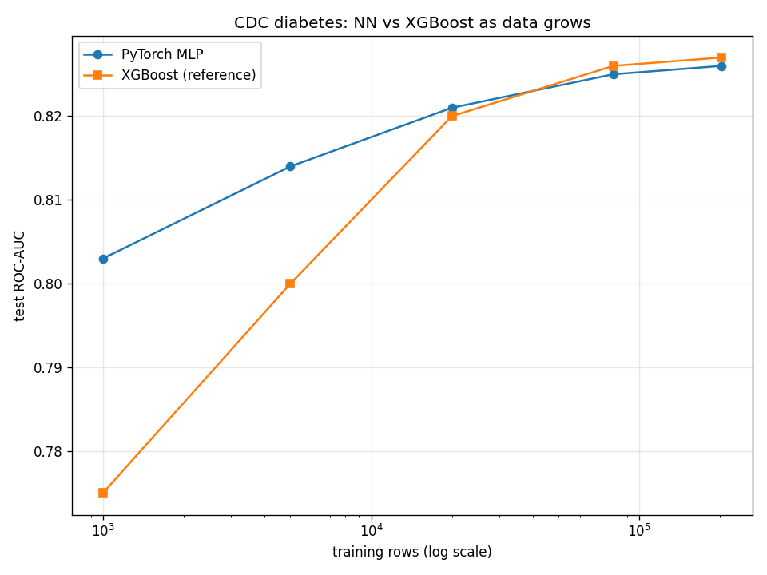

# Deep-Learning Study — does more data make the NN better? (NN-only)

**Scope:** this is a *neural-network learning study only*. It does **not** touch the served
models or the API — the deployable diabetes/heart models are unchanged. Code: `src/nn_study.py`,
data via `src/fetch_nhanes.py`. XGBoost appears only as a **reference yardstick** (untuned,
fixed hyperparameters — so don't read it as our best tree model).

We added two things you asked for: **NHANES** (a real, vitals-based CDC survey, ~15.5k adults,
assembled from 3 cycles) and **TabNet** (a neural network architecture purpose-built for tables).

## 1. Head-to-head on large datasets (20k sample each)

| Dataset | PyTorch MLP | TabNet | XGBoost (ref) |
|---|---|---|---|
| CDC/BRFSS (253k) | **0.833** | 0.810 | 0.831 |
| iammustafatz 100k (HbA1c) | 0.976 | 0.972 | **0.979** |
| Cardiovascular 70k | **0.803** | 0.770 | 0.802 |
| NHANES 15k | **0.798** | 0.795 | 0.789 |

## 2. Scaling curve — CDC diabetes, MLP vs XGBoost as training data grows

| Train rows | MLP | XGBoost (ref) | gap (XGB−MLP) |
|---|---|---|---|
| 1,000 | 0.803 | 0.775 | −0.028 |
| 5,000 | 0.814 | 0.800 | −0.014 |
| 20,000 | 0.821 | 0.820 | 0.000 |
| 80,000 | 0.825 | 0.826 | +0.001 |
| 202,944 (full) | 0.826 | 0.827 | +0.001 |

## What we learned

1. **More data makes the NN fully competitive.** On the large datasets the MLP **matches**
   gradient boosting (both converge to ≈0.826 on CDC). This is the direct answer to the
   question: yes, scale closes the gap — the NN is no longer behind once it has enough rows.
2. **But it doesn't *decisively beat* boosting** — the two track within ±0.01 at scale. This is
   the expected tabular-data result: with enough data the NN reaches parity, not dominance.
3. **TabNet underperformed a plain MLP** on every dataset. The specialized tabular-DL
   architecture added complexity without benefit here — a common finding without heavy tuning.
   Fancier ≠ better.
4. **This contrasts with our earlier small-data result.** On the tiny clinical sets (Pima 768,
   UCI ~920) with *tuned* trees, gradient boosting won (`nn_discussion.md`). The lesson isn't
   "trees always win" or "NNs always win" — it's **sample size decides**: trees dominate small
   tabular data, NNs reach parity on large tabular data.
5. **The HbA1c dataset (~0.97 for all models)** is "easy" because HbA1c is near-diagnostic — it
   inflates every model and isn't a meaningful discriminator between methods.

## Honest caveats
- The reference XGBoost here is **untuned** (fixed hyperparameters), so the MLP's small-sample
  lead is partly that a tuned XGBoost would do better at 1k rows. The trustworthy takeaway is the
  **parity at scale**, not the small-n ordering.
- This study uses glucose-allowed features (it's about *learning*, not deployment). The deployed
  diabetes model remains the glucose-free CDC model from `train_compare.py`, unchanged.
- Where deep learning would genuinely *beat* trees is a different modality — raw rPPG **waveforms**
  (Group 1's signal), not these tabular features.
